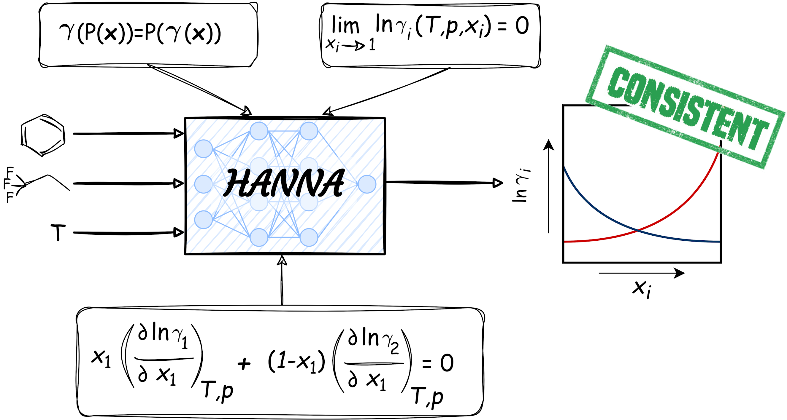
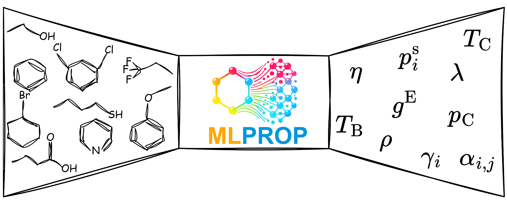

# HANNA Project
[](https://pubs.rsc.org/en/Content/ArticleLanding/2024/SC/D4SC05115G)
[](./LICENSE)
[](https://colab.research.google.com/gist/tspecht93/0175be57151b77acdfd8d81022532fe7/hanna.ipynb)
[](https://ml-prop.mv.rptu.de/)




This repository contains the implementation of our **HA**rd-constraint **N**eural **N**etwork for **A**ctivity coefficient prediction (HANNA). HANNA can be used to predict activity coefficients in any binary mixture whose components can be represented as SMILES strings. You can find details on HANNA in our [paper](https://pubs.rsc.org/en/Content/ArticleLanding/2024/SC/D4SC05115G).

## MLPROP Website
You can explore HANNA and other models interactively on our new website, [MLPROP](https://ml-prop.mv.rptu.de/), without any installation.


## Demonstration in Google Colab

If you do not want to install the required packages right now, you can directly try HANNA out in [Colab](https://colab.research.google.com/gist/tspecht93/0175be57151b77acdfd8d81022532fe7/hanna.ipynb).

## Installation

To set up the project, follow these steps:

1. **Clone the repository:**

   ```bash
   git clone https://github.com/tspecht93/HANNA.git
   cd HANNA
   ```
2. **Create the conda environment:**

   Use the provided `.yml` file to create the conda environment.

   For Windows:

   ```bash
   conda env create -f HANNA.yml
   ```

   For Linux:

      ```bash
   conda env create -f HANNA_Linux.yml
   ```

   

4. **Activate the environment:**

   ```bash
   conda activate HANNA
   ```

## Usage

You can use the `HANNA.ipynb` notebook, which provides a demonstration of how to calculate activity coefficients for a binary mixture.

## Contents

- `__init__.py`: Initialization file for the package.
- `HANNA.py`: Contains the neural network architecture of HANNA.
- `Own_Scaler.py`: Custom scaler implementation for preprocessing.
- `Plots.py`: Function for creating and exporting the plot. Raw values will be saved as csv.
- `Utils.py`: Utility functions used throughout the project.
- `HANNA.ipynb`: Jupyter notebook demonstrating the usage of HANNA.
- `HANNA.yml`: Conda environment configuration file for Windows users.
- `HANNA_Linux.yml`: Conda environment configuration file for Linux users.
- `README.md`: Project documentation.
- `License.txt`: Contains license information for the HANNA.

## License

This project is licensed under the MIT License. See the LICENSE file for details.
